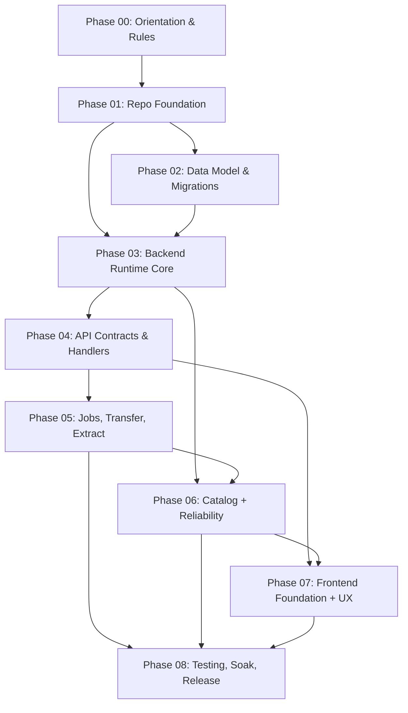

# SeedSync v2 Phase Playbook

## Purpose
This playbook breaks the greenfield rewrite into explicit phases that you can implement with AI support without losing architectural direction. Each phase file is both:

- a teaching guide for you (context, failure modes, review notes)
- an execution contract for Codex (ordered tasks, acceptance criteria, handoff prompt)

Read phases in order. Do not start a phase until the prior phase acceptance criteria are met.

## Phase Order
1. `phase-00-orientation-and-rules.md`
2. `phase-01-repo-foundation.md`
3. `phase-02-data-model-and-migrations.md`
4. `phase-03-backend-runtime-core.md`
5. `phase-04-api-contracts-and-handlers.md`
6. `phase-05-jobs-transfer-extract.md`
7. `phase-06-catalog-reconciliation-reliability.md`
8. `phase-07-frontend-foundation-and-ux.md`
9. `phase-08-testing-soak-release.md`

## Dependency Graph

## Working Method with AI
1. Start each phase by pasting that phase’s “Handoff Prompt for Codex”.
2. Keep PRs scoped to one phase only.
3. Block merges if any acceptance criterion in the phase file is unmet.
4. Capture deviations in `docs/adr/` as short architecture decisions.
5. If an implementation choice would impact a later phase contract, update this playbook first, then implement.

## Definition of Done (Per Phase)
- Ordered implementation checklist is complete.
- Testing tasks for that phase are passing.
- Acceptance criteria are all true.
- Human pairing review items were checked manually.
- Any discovered cross-phase constraints were documented.

## Non-Negotiables
- Greenfield architecture: no compatibility coupling to legacy internals.
- No migration/import of legacy persisted state.
- Single-user local-first target.
- Big-bang replacement trajectory.
- `lftp` provider first, behind a stable transfer interface.

